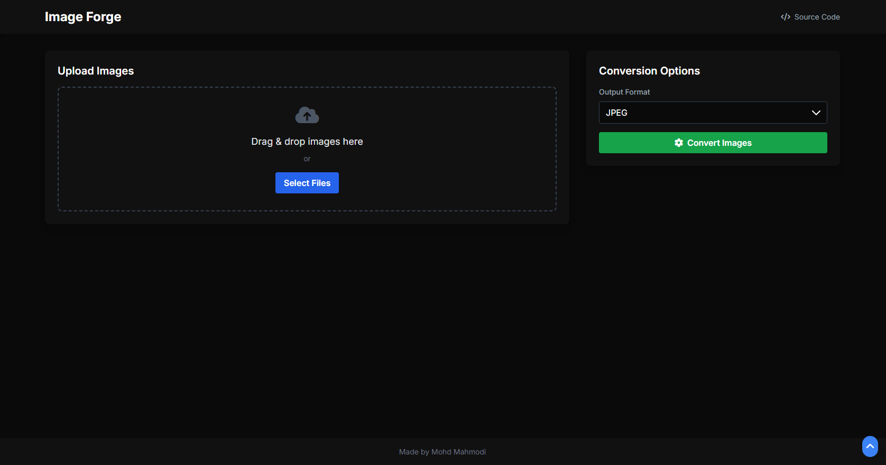
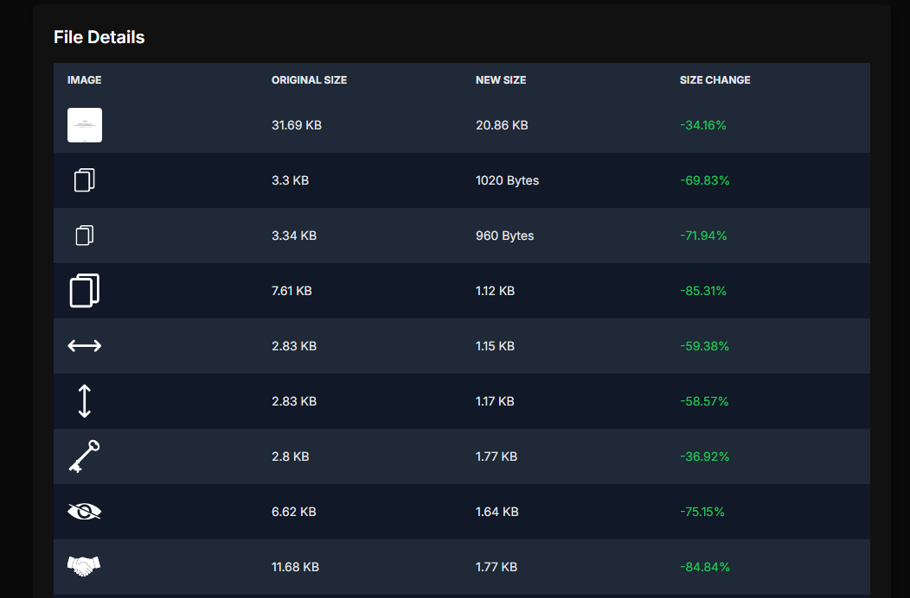
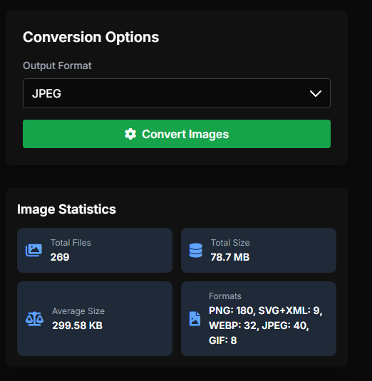
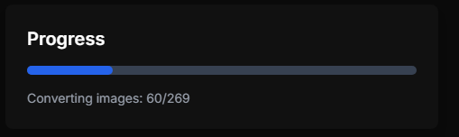
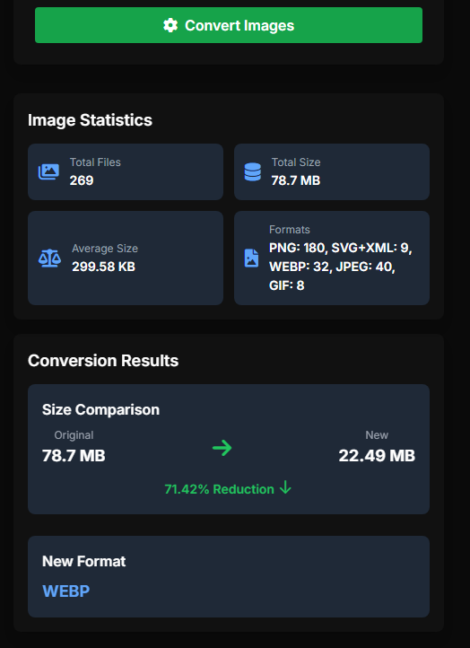

# Image Forge

<div align="center">
  
</div>

<p align="center">
  
  
  <a href="https://twitter.com/mohdmahmodi" target="_blank">
    
  </a>
</p>

<p align="center">
  <b>🔥 Powerful Client-Side Image Conversion and Optimization Tool 🔥</b>
</p>

<p align="center">
  <a href="#✨-key-features">Key Features</a> •
  <a href="#🚀-how-it-works">How It Works</a> •
  <a href="#🏁-getting-started">Getting Started</a> •
  <a href="#📊-performance">Performance</a> •
  <a href="#❓-faq">FAQ</a> •
  <a href="#📄-license">License</a>
</p>

## ✨ Key Features

- 🌈 **Universal Input Support**: Upload any image format your browser recognizes
- 🎨 **Multiple Output Formats**: Convert to JPEG, PNG, or WebP
- 🚀 **Lightning-Fast Processing**: All conversions happen right in your browser
- 📦 **Bulk Conversion**: Process hundreds of images in one go
- 📊 **Real-time Statistics**: Instant insights into file sizes and conversion ratios
- 🔒 **100% Private**: Your images never leave your device
- 📱 **Responsive Design**: Seamless experience on both desktop and mobile
- 🌙 **Dark Mode**: Easy on the eyes, perfect for night owls

## 🚀 How It Works

<div align="center">
  
</div>

1. **Upload**: Drag & drop or select images using the file picker
2. **Preview**: View your selected images and file details
3. **Choose Format**: Select your desired output format (JPEG, PNG, or WebP)
4. **Convert**: Click "Convert Images" to start the magic
5. **Download**: Get your optimized images in a convenient zip file

## 🏁 Getting Started

```bash
# Clone the repo
git clone https://github.com/mohdyahyamahmodi/image-forge.git

# Navigate to the project
cd image-forge

# Open in your browser
open index.html
```

That's it! No complex setup or server required. Image Forge runs entirely in your browser.

## 💻 Usage

<div align="center">
  
  
</div>

1. **Upload Images**: Drag & drop onto the designated area or use the file picker
2. **Review Stats**: Check out the detailed statistics of your uploaded images
3. **Select Format**: Choose JPEG, PNG, or WebP from the dropdown
4. **Convert**: Hit the "Convert Images" button and watch the progress
5. **Download**: Once complete, download your optimized image package

## 📊 Performance

Image Forge is built for speed and efficiency. Here's what you can expect:

<div align="center">
  
</div>

- **Bulk Processing**: Successfully tested with 400 images on a low-spec machine
- **Processing Time**: ~30 seconds for 400 images (varies based on image size and device specs)
- **Size Reduction**: Achieve significant file size reductions without compromising quality

> 📝 Note: Actual results may vary depending on input images and device capabilities.

## ❓ FAQ

<details>
<summary><strong>Is there a limit to how many images I can process?</strong></summary>
There's no set limit! The practical limit depends on your device's RAM and processing power. We've successfully tested with 400 images on a low-spec machine.
</details>

<details>
<summary><strong>What input formats does Image Forge support?</strong></summary>
Image Forge accepts any image format that your browser can read. This typically includes JPEG, PNG, GIF, WebP, SVG, and many more.
</details>

<details>
<summary><strong>What output formats are available?</strong></summary>
Currently, you can convert your images to JPEG, PNG, or WebP. These formats offer an excellent balance of quality and compatibility.
</details>

<details>
<summary><strong>Is my data safe?</strong></summary>
Absolutely! All processing happens locally in your browser. Your images never leave your device, ensuring maximum privacy and security.
</details>

<details>
<summary><strong>Can I use Image Forge for commercial projects?</strong></summary>
Yes! Image Forge is released under the MIT License, which allows for both personal and commercial use. See the LICENSE file for details.
</details>

## 📄 License

This project is licensed under the MIT License. See the [LICENSE](LICENSE) file for details.

---

<div align="center">
  Crafted with 💻 by <a href="https://github.com/mohdyahyamahmodi">Mohd Mahmodi</a>
</div>

<div align="center">
  <a href="https://github.com/mohdyahyamahmodi" target="_blank">
    
  </a>
</div>